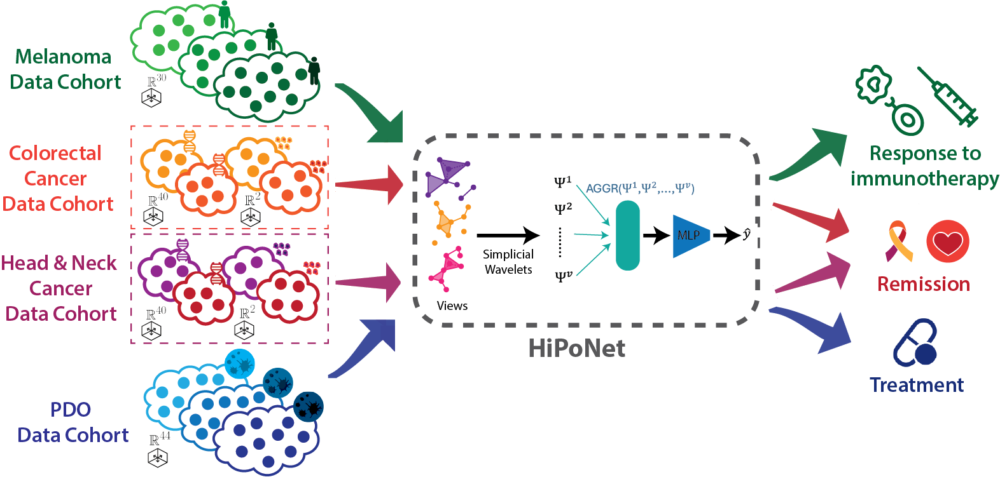

# HiPoNet

This repository is for HiPoNet, a method designed to learn from high-dimensional point cloud data using multiple graph embeddings and graph wavelet transforms.

## Overview

The provided Python script trains HiPoNet on a given dataset of point features and associated labels. It uses:

- **PyTorch** for model definition and training.
- **wandb** (Weights & Biases) for experiment tracking.
- **scikit-learn** for data splitting.
- **tqdm** for progress visualization.

The script:
1. Loads and processes your input data.
2. Initializes the model and MLP classifier.
3. Trains the model, logging training progress and metrics to `wandb`.
4. Saves the best model weights for reproducibility.

## Unsupervised HiPoNet Latent Space

`unsupervised_main.py` trains the HiPoNet wavelet autoencoder, reloads the
checkpoint with the best validation loss, exports one latent vector per point
cloud population, and creates a PHATE plot.

Population caches are NumPy `.npz` files with a required `populations` array.
Each element must be a `(n_points, n_features)` array; populations may contain
different numbers of points. Optional `labels`, `group_names`, and `group_keys`
arrays provide plot metadata. A precomputed finite, symmetric population
distance matrix can be supplied through `--udemd_cache`.

```bash
uv run python unsupervised_main.py \
  --raw_dir data/populations.npz \
  --udemd_cache data/population_distances.npy \
  --dist_weight 0.1 \
  --latent_dim 16 \
  --num_epochs 120 \
  --batch_size 8 \
  --phate_color_by Treatment \
  --save_dir checkpoints/hiponet_run \
  --disable_wb
```

The run writes `best_model.pt`, `training_summary.json`,
`latent_representations.npy`, `labels.npy`, `phate_embedding.npy`, and
`latent_phate.png` under `--save_dir`. Use `--dist_weight 0` when no population
distance regularizer is required.

An existing latent export can also be plotted independently:

```bash
uv run python -m utils.latent_space \
  --latents checkpoints/hiponet_run/latent_representations.npy \
  --labels checkpoints/hiponet_run/labels.npy \
  --population_cache data/populations.npz \
  --color_by Treatment \
  --output checkpoints/hiponet_run/latent_phate.png
```

## Requirements

- Python 3.7 or later
- PyTorch (compatible with CUDA if GPU training is desired)
- NumPy
- scikit-learn
- tqdm
- wandb

Install all requirements using:
```bash
pip install torch numpy scikit-learn tqdm wandb
```

## Arguments

You can specify various arguments to customize training:

- `--raw_dir` (str): Directory containing the raw data. Default: `melanoma_data_full`
- `--full` (flag): If provided, may indicate the use of a full dataset variant.
- `--num_weights` (int): Number of weights (features dimensions) to learn. Default: 2
- `--threshold` (float): Threshold used for graph creation. Default: `5e-5`
- `--hidden_dim` (int): Hidden dimension size for the MLP. Default: `50`
- `--num_layers` (int): Number of MLP layers. Default: `3`
- `--lr` (float): Learning rate. Default: `0.03`
- `--wd` (float): Weight decay. Default: `3e-3`
- `--num_epochs` (int): Number of training epochs. Default: `100`
- `--batch_size` (int): Batch size for training. Default: `128`
- `--gpu` (int): GPU index to use. Set to `-1` for CPU-only. Default: `0`

## Running the Script

Before running, ensure that `raw_dir` points to a directory containing compatible data files. The data loading and preparation code is assumed to be handled within the `PointCloudFeatLearning` class. Consult that class for specifics on required data format.

Run the script:
```bash
python train_pointcloudnet.py --raw_dir path_to_data --num_weights 2 --threshold 0.00005 --gpu 0
```

Adjust parameters as needed. For example:
- To train on CPU:
    ```bash
    python train_pointcloudnet.py --gpu -1
    ```
- To change the learning rate and number of epochs:
    ```bash
    python train_pointcloudnet.py --lr 0.01 --num_epochs 200
    ```

## Weights & Biases Integration

The script automatically logs metrics to [Weights & Biases](https://wandb.ai/) if you have an account and have run `wandb login` locally. If you do not want to use `wandb`, remove or comment out the `wandb` lines in the code.

## Outputs

- **Model Checkpoints:** The best performing model weights will be saved as `bestalpha_{num_weights}` and `bestmlp_{num_weights}`.
- **Alpha Weights:** The learned alpha weights for feature importance are saved as `bestweights_{num_weights}.pt`.

These files can be used to reproduce results or for downstream analysis.
```
